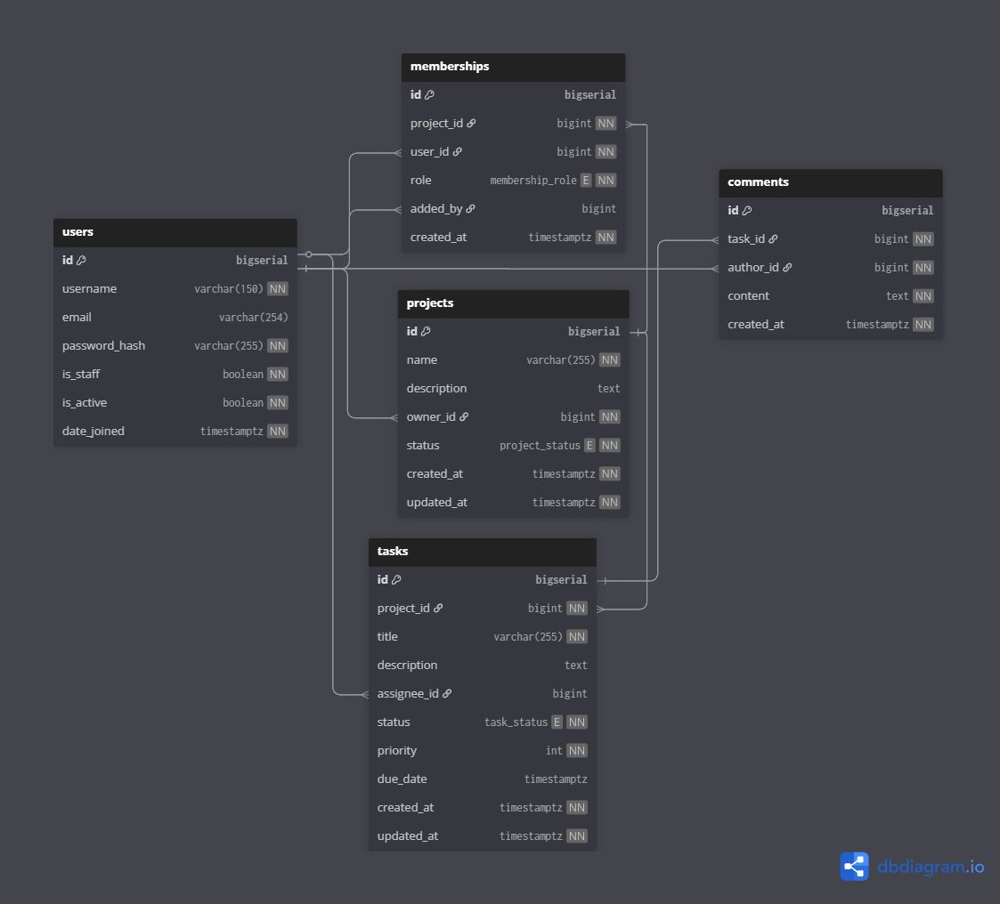

# 🛠 Collaborative Task & Project Management App

## 📌 Overview
A Django + DRF-based backend for collaborative project and task management.

## 🗺 Architecture Diagram

## 🚀 Features
- Admin can create projects & assign members
- Project owners can create tasks
- Users can comment on tasks
